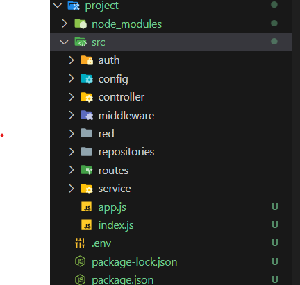

# BeMasterBackend
BeMasterBackend es un sistema CRUD para gestionar usuarios y videos.

## BASE DE DATOS 

### Construcción de la base de datos

Para comenzar, necesitas configurar la base de datos. A continuación se muestra el script SQL para crear la estructura de la base de datos y agregar algunos datos de prueba:

```sql
-- Elimina la base de datos 'be_master' si existe
DROP DATABASE IF EXISTS be_master;

-- Crea la base de datos 'be_master'
CREATE DATABASE be_master;

-- Selecciona la base de datos 'be_master' para su uso
USE be_master;

-- Crea la tabla 'usuarios' con los siguientes campos:
--   - id: Identificador único de usuario (clave primaria, auto_incrementado)
--   - nombre: Nombre del usuario (cadena de caracteres de hasta 30 caracteres)
--   - apellido: Apellido del usuario (cadena de caracteres de hasta 30 caracteres)
--   - correo: Correo electrónico del usuario (cadena de caracteres de hasta 100 caracteres, único)
--   - edad: Edad del usuario (entero)
--   - contrasena: Contraseña del usuario (cadena de caracteres de hasta 100 caracteres)
--   - estado: Estado del usuario (entero)
CREATE TABLE usuarios(
    id INT PRIMARY KEY AUTO_INCREMENT,
    nombre VARCHAR(30),
    apellido VARCHAR(30),
    correo VARCHAR(100) UNIQUE,
    edad INT, 
    contrasena VARCHAR(100),
    estado INT
);

-- Crea la tabla 'videos' con los siguientes campos:
--   - id: Identificador único de video (clave primaria, auto_incrementado)
--   - nombre: Nombre del video (cadena de caracteres de hasta 30 caracteres)
--   - tipo: Tipo del video (booleano)
--   - calificacion: Calificación del video (entero)
--   - usuario_id: Identificador del usuario que subió el video (clave foránea referenciando usuarios(id))
CREATE TABLE videos(
    id INT PRIMARY KEY AUTO_INCREMENT,
    nombre VARCHAR(30),
    tipo BOOL,
    calificacion INT,
    usuario_id INT,
    CONSTRAINT fk_videos_usuarios_usaruio_id FOREIGN KEY (usuario_id) REFERENCES usuarios(id)
);

-- Inserta datos en la tabla 'usuarios'
INSERT INTO usuarios (nombre, apellido, edad, contrasena, correo, estado) VALUES
    ("Martin", "Lozano", 19, "$2b$05$2XakDC/b0izzSPZ6AlwMFuzRXE.b0XhDqeGU91mOosjKE6vjzYqxy", "mart@prueba.com", 1), -- abcd
    ("Jesus", "Gonzalez", 30, "$2b$05$1BBNKdOyv8gnQMnkpKD/POR1phihesmLN2nyipZdWAyR5qlHP4Y3.", "jesus@prueba.com", 1), -- admin
    ("Nicolas", "Cerquera", 19, "$2b$05$GDqP9UAqkVZtX2DcaxJKyO.Sql7PXVFbJ1Ygy4aDKAKhR/bkfCnju", "nicolas@prueba.com", 1), -- nicolas
    ("Johan", "Celis", 19, "$2b$05$xqkp.wIr8KSago7AabetROVxqKlYSVpyc1e/4rWYpWUYJ/8dferuO", "johan@prueba.com", 1), -- johan
    ("Maryi", "Vargas", 19, "$2b$05$TauLhoKyWLMcSxEf/HqwqOJVuPbYf1b2BTNgxm5qAERJ9Btdq3ZoW", "maryi@prueba.com", 1); -- maryi
    
-- Inserta datos en la tabla 'videos'
INSERT INTO videos (nombre, tipo, calificacion, usuario_id) VALUES
    ("Aguaman", 1, 9, 1),
    ("Pitufos", 1, 10, 1),
    ("Fast And Furious", 1, 10, 1),
    ("Blanca Nieves", 1, 8, 2),
    ("Saw VI", 1, 7, 2),
    ("El Conjuro", 1, 9, 2),
    ("El Hueco", 1, 5, 3),
    ("Superman", 1, 10, 3),
    ("Flash", 1, 6, 3),
    ("Los Increibles", 1, 7, 4),
    ("Las Tortugas Ninja", 1, 8, 4),
    ("Rapunzel", 1, 9, 4);
```

### Diagrama MR


## BACKEND

### Arquitectura 


### Correr aplicación

Para ejecutar el proyecto, primero debe navegar al directorio raíz del mismo desde la terminal. Una vez en el directorio raíz, puede iniciar el servidor ejecutando el siguiente comando:
```js
npm run dev
```
Este comando iniciará el servidor y ejecutará la aplicación en modo de desarrollo. Asegúrese de que todas las dependencias estén instaladas correctamente antes de ejecutar este comando.

###


## Documentación Swagger


#### Servicio para generar el token JWT


#### Copiar token


```json
{
  "error": false,
  "status": 200,
  "body": "eyJhbGciOiJIUzI1NiIsInR5cCI6IkpXVCJ9.eyIwIjp7ImlkIjoyLCJub21icmUiOiJKZXN1cyIsImFwZWxsaWRvIjoiR29uemFsZXoiLCJjb3JyZW8iOiJqZXN1c0BwcnVlYmEuY29tIiwiZWRhZCI6MzAsImNvbnRyYXNlbmEiOiIkMmIkMDUkMUJCTktkT3l2OGduUU1ua3BLRC9QT1IxcGhpaGVzbUxOMm55aXBaZFdBeVI1cWxIUDRZMy4iLCJlc3RhZG8iOjF9LCJpYXQiOjE3MDczMzY3ODh9.gwLbcN0k6hhHm22tPsMMSPVrthM5L5yJ5MIzXhtJKtE"
}
```

### Usar otro servicio, para ello copiar el token en  "authorization"
* Bearer + token
```json
{
     "body": "eyJhbGciOiJIUzI1NiIsInR5cCI6IkpXVCJ9.eyIwIjp7ImlkIjoyLCJub21icmUiOiJKZXN1cyIsImFwZWxsaWRvIjoiR29uemFsZXoiLCJjb3JyZW8iOiJqZXN1c0BwcnVlYmEuY29tIiwiZWRhZCI6MzAsImNvbnRyYXNlbmEiOiIkMmIkMDUkMUJCTktkT3l2OGduUU1ua3BLRC9QT1IxcGhpaGVzbUxOMm55aXBaZFdBeVI1cWxIUDRZMy4iLCJlc3RhZG8iOjF9LCJpYXQiOjE3MDczMzY3ODh9.gwLbcN0k6hhHm22tPsMMSPVrthM5L5yJ5MIzXhtJKtE"
}
```


### Usar servicio

### End Point Usuarios


